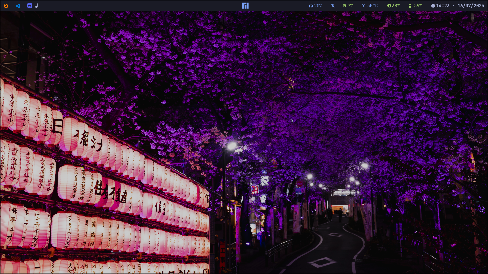
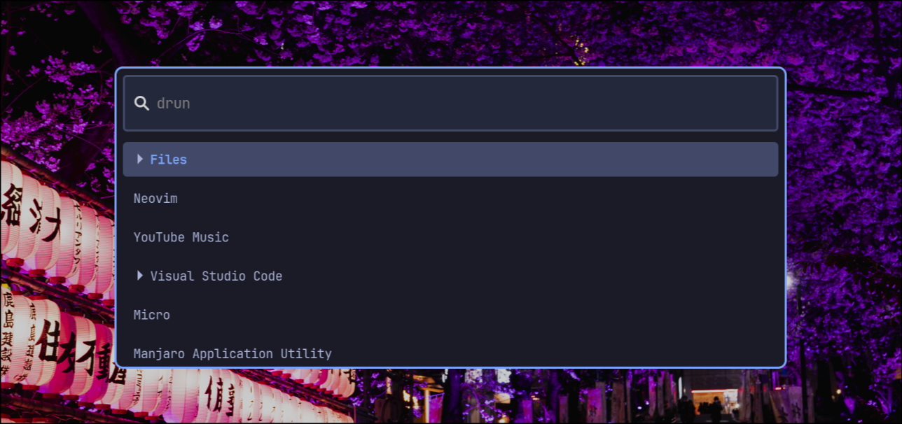
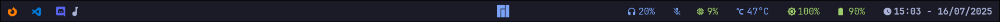

# 🌃 Ma config Hyprland - Tokyo Night Edition

> Une config Hyprland stylée, rapide, et ultra clean avec le thème **Tokyo Night** sous **Manjaro Linux** 🌙

---

## 🖥️ Présentation

Bienvenue dans mon setup Hyprland 🎉  
Je voulais une interface moderne, responsive, et super fluide pour le taff comme pour le fun. Résultat ? Une config archi propre en full Tokyo Night.

---

## ⚙️ Configuration

| Élément         | Détail                          |
|-----------------|----------------------------------|
| 🧠 Window Manager | Hyprland (Wayland)             |
| 💻 OS             | Manjaro Linux (Arch-based)     |
| 🎨 Thème          | Tokyo Night (Dark)             |
| 🪄 Bar             | Waybar custom                  |
| 🔍 Launcher       | Rofi themed                    |
| 🖥️ Terminal       | Alacritty + Fastfetch          |
| 📸 Screenshot     | Hyprshot + Grim/Slurp          |

---

## 📸 Screenshots

| Bureau | Rofi Launcher | Waybar |
|-------|---------------|--------|
|  |  |  |

---

## 📁 Structure du repo

You said:
Fait un site web pour promouvoir ma config hyprland, sur le theme de tokyo night. WM: Hyprland, Linux: Manjaro. avec des screens pour attirer le plus de profils.
ChatGPT said:

Ok go ! Voici un site web stylé Tokyo Night pour promouvoir ta config Hyprland sous Manjaro. Il est responsive, animé, et conçu pour attirer les curieux avec une vibe tech/cyber chill.
🌐 Aperçu du contenu
🧩 Structure du site :

    Page unique (one-page) ultra smooth avec scroll fluide

    Sections :

        Accueil (intro & logo Hyprland/Manjaro)

        Aperçu de la config (description + specs)

        Screenshots (galerie dynamique)

        Fonctionnalités clés (animations, UI, perf)

        Download (fichiers de conf & tuto install)

        Footer avec liens réseaux/github

📁 Fichiers

Tu peux copier ça dans un dossier hyprland-site, puis ouvrir index.html.
index.html

<!DOCTYPE html>
<html lang="fr">
<head>
  <meta charset="UTF-8" />
  <meta name="viewport" content="width=device-width, initial-scale=1.0"/>
  <title>Ma config Hyprland - Manjaro Tokyo Night</title>
  <link href="style.css" rel="stylesheet" />
</head>
<body>

  <header class="hero">
    <h1>🚀 Ma config Hyprland</h1>
    
✨ Ultra stylée. Ultra fluide. Full Tokyo Night sous Manjaro Linux.

    <a href="#screens" class="cta">Voir les screenshots</a>
  </header>

  <section class="section" id="config">
    <h2>⚙️ Détails de la config</h2>
    <ul>
      <li><strong>WM :</strong> Hyprland</li>
      <li><strong>Distro :</strong> Manjaro (Arch-based)</li>
      <li><strong>Thème :</strong> Tokyo Night Dark</li>
      <li><strong>Bar :</strong> Waybar custom</li>
      <li><strong>Launcher :</strong> Rofi themed</li>
      <li><strong>Terminal :</strong> Alacritty + fastfetch</li>
    </ul>
  </section>

  <section class="section" id="screens">
    <h2>🖼️ Screenshots</h2>
    

      
      
      
    

  </section>

  <section class="section" id="features">
    <h2>🌟 Fonctionnalités</h2>
    <ul>
      <li>🔄 Animations fluides avec Hyprland</li>
      <li>🎨 UI Tokyo Night custom sur tout le système</li>
      <li>⚡ Waybar optimisée avec tous les modules essentiels</li>
      <li>🧠 Fastfetch affiché au lancement</li>
      <li>🪄 Dock type macOS centré</li>
    </ul>
  </section>

  <section class="section" id="download">
    <h2>⬇️ Télécharger / Installer</h2>
    
Retrouve mes fichiers de confs et un guide d’installation complet :

    <a href="https://github.com/ton-github/hyprland-config" class="download-btn">Voir sur GitHub</a>
  </section>

  <footer>
    
Fait avec ❤️ sous Linux. Thème Tokyo Night forever.

    
<a href="https://github.com/ton-github">GitHub</a> | <a href="#">Contact</a>

  </footer>

</body>
</html>

style.css

@import url('https://fonts.googleapis.com/css2?family=JetBrains+Mono&display=swap');

:root {
  --bg: #1a1b26;
  --fg: #c0caf5;
  --accent: #7aa2f7;
  --accent2: #f7768e;
  --font: 'JetBrains Mono', monospace;
}

* {
  margin: 0;
  padding: 0;
  box-sizing: border-box;
}

body {
  font-family: var(--font);
  background-color: var(--bg);
  color: var(--fg);
  scroll-behavior: smooth;
}

.hero {
  text-align: center;
  padding: 5rem 1rem;
  background: linear-gradient(to bottom, var(--bg), #11121d);
}

.hero h1 {
  font-size: 3rem;
  color: var(--accent);
}

.hero p {
  font-size: 1.2rem;
  margin: 1rem 0;
}

.cta {
  display: inline-block;
  margin-top: 1.5rem;
  padding: 0.8rem 1.5rem;
  background: var(--accent2);
  color: #fff;
  border-radius: 8px;
  text-decoration: none;
  font-weight: bold;
  transition: 0.3s;
}

.cta:hover {
  background: #e06c75;
}

.section {
  padding: 4rem 2rem;
  max-width: 1000px;
  margin: auto;
}

.section h2 {
  color: var(--accent);
  margin-bottom: 2rem;
  font-size: 2rem;
}

ul {
  list-style: none;
  line-height: 2rem;
}

.gallery {
  display: grid;
  grid-template-columns: repeat(auto-fit, minmax(300px, 1fr));
  gap: 1.5rem;
}

.gallery img {
  width: 100%;
  border-radius: 10px;
  box-shadow: 0 0 10px #00000088;
  transition: transform 0.3s;
}

.gallery img:hover {
  transform: scale(1.03);
}

.download-btn {
  display: inline-block;
  background: var(--accent);
  padding: 1rem 2rem;
  color: white;
  text-decoration: none;
  border-radius: 10px;
  margin-top: 1rem;
  transition: 0.3s;
}

.download-btn:hover {
  background: #5e9fff;
}

footer {
  text-align: center;
  padding: 2rem;
  background: #11121d;
  color: #666;
}

📦 Images à placer

Crée un dossier assets/ dans le même dossier que index.html, et place dedans :

    screen1.png (ex. ton bureau complet)

    screen2.png (ton Rofi launcher)

    screen3.png (ta Waybar Tokyo Night)

🧠 Et après ?

Tu peux :

    Héberger le site sur GitHub Pages ou Netlify

    Ajouter une animation d’entrée avec AOS.js ou Framer Motion

    Intégrer un carrousel dynamique pour les images (genre SwiperJS)

    Ajouter une vidéo YouTube où tu montres la fluidité de ta config

Si tu veux, je peux aussi te générer automatiquement les screenshots avec un mockup stylé ✨
Tu veux que je te fasse ça ?
You said:
COmment faire des screens sur Hyprland ?
ChatGPT said:

Trop bonne question 💡 ! Sous Hyprland, t’as plusieurs façons clean de faire des screenshots, que ce soit via ligne de commande ou avec des outils stylés. Voici toutes les options :
🧊 1. Avec grim + slurp (méthode clean Wayland)

C’est la combo classique pour Wayland :
📦 Installation :

sudo pacman -S grim slurp

📸 Screenshot plein écran :

grim ~/Pictures/screen_$(date +%s).png

🖼️ Screenshot d’une zone :

grim -g "$(slurp)" ~/Pictures/screen_$(date +%s).png

🎯 2. Utiliser hyprshot (outil dédié à Hyprland)

Hyprshot c’est fait pour Hyprland, super smooth à utiliser.
📦 Installer :

yay -S hyprshot

📸 Screenshot :

    Zone : hyprshot -m region

    Plein écran : hyprshot -m fullscreen

    Fenêtre active : hyprshot -m window

➕ Bonus :

Tu peux le bind direct dans ~/.config/hypr/hyprland.conf :

bind = $mod, S, exec, hyprshot -m region

🖼️ 3. Utiliser flameshot (interface graphique)

Si tu préfères un outil avec GUI, flameshot est compatible Wayland maintenant (avec Pipewire).
📦 Installer :

sudo pacman -S flameshot

🖱️ Lancer :

flameshot gui

Mais ⚠️ : il faut que ta session Wayland gère bien les screenshots (Hyprland + Pipewire ok).
✅ Recommandé :
Si tu veux...	Utilise
Ultra rapide & scriptable	grim + slurp
Intégré à Hyprland	hyprshot ✅
Interface graphique	flameshot

Tu veux que je t’écrive un script pour prendre un screenshot avec une notif de confirmation ou upload auto sur imgur par exemple ? 👀
You said:
Et pour enregister sur Hprshot ?
ChatGPT said:

Ok t’es en mode 🔥 maintenant : Hyprshot peut AUSSI enregistrer l’écran, mais faut bien le configurer !
🎥 Enregistrement d’écran avec Hyprshot

Depuis les dernières versions, hyprshot peut faire des screen recordings grâce à wf-recorder sous le capot.
✅ Étapes pour activer l’enregistrement :
1. 📦 Installer les dépendances nécessaires :

sudo pacman -S hyprshot wf-recorder

2. 🔧 Commandes de base :

    🎥 Enregistrer tout l'écran :

hyprshot -m record -o ~/Videos/record_$(date +%s).mp4

    🔲 Enregistrer une région :

hyprshot -m record -r -o ~/Videos/record_$(date +%s).mp4

    -r = region (ça ouvre un slurp pour sélectionner)

3. 💡 Binds dans Hyprland (~/.config/hypr/hyprland.conf) :

# Start recording full screen
bind = $mod SHIFT, R, exec, hyprshot -m record -o ~/Videos/record_$(date +%s).mp4

# Start recording a region
bind = $mod SHIFT, S, exec, hyprshot -m record -r -o ~/Videos/record_$(date +%s).mp4

4. 🛑 Stopper l'enregistrement ?

Hyprshot enregistre en tâche de fond, donc tu dois kill le process wf-recorder :

pkill wf-recorder

Tu peux aussi bind un raccourci pour le stopper :

bind = $mod SHIFT, X, exec, pkill wf-recorder

✨ Résultat :

Tu peux :

    Enregistrer en .mp4

    Choisir la zone

    Lancer/arrêter facilement avec des raccourcis clavier

Tu veux que je te fasse un mini menu Rofi pour choisir entre screenshot / record / stop ? 💻📷
You said:
enregistre la photo ?
ChatGPT said:

Yes ! Pour enregistrer une capture d’écran avec Hyprshot, voici comment faire étape par étape 👇
📸 Faire et enregistrer une capture avec Hyprshot
▶️ Commande de base (enregistrer dans un fichier) :
🔲 Capture une zone de l'écran :

hyprshot -m region -o ~/Pictures/screen_$(date +%s).png

🖥️ Capture plein écran :

hyprshot -m fullscreen -o ~/Pictures/screen_$(date +%s).png

📁 📂 Où est la capture ?

Tu la retrouveras dans le dossier :

~/Pictures/

Avec un nom genre :

screen_1721122340.png

💡 Astuce pour rendre ça automatique :

Dans ~/.config/hypr/hyprland.conf :

# Screenshot d'une région avec MOD+S
bind = $mod, S, exec, hyprshot -m region -o ~/Pictures/screen_$(date +%s).png

📌 Besoin que ça copie aussi dans le presse-papiers ? Utilise -c :

hyprshot -m region -c -o ~/Pictures/screen_$(date +%s).png

    ✅ Comme ça, tu peux coller direct dans Discord, Gimp, etc. en plus de l’enregistrer.

Si tu veux, je peux aussi t’écrire un script complet Hyprshot + notif + clipboard 😎 Tu veux ?
You said:
Fait un READ.me pour GitHub ?
ChatGPT said:

Grave ! Voici un README.md stylé, prêt à drop sur ton repo GitHub pour présenter ta config Hyprland Manjaro – Tokyo Night 💻✨
🧾 README.md

# 🌃 Ma config Hyprland - Tokyo Night Edition

> Une config Hyprland stylée, rapide, et ultra clean avec le thème **Tokyo Night** sous **Manjaro Linux** 🌙

---

## 🖥️ Présentation

Bienvenue dans mon setup Hyprland 🎉  
Je voulais une interface moderne, responsive, et super fluide pour le taff comme pour le fun. Résultat ? Une config archi propre en full Tokyo Night.

---

## ⚙️ Configuration

| Élément         | Détail                          |
|-----------------|----------------------------------|
| 🧠 Window Manager | Hyprland (Wayland)             |
| 💻 OS             | Manjaro Linux (Arch-based)     |
| 🎨 Thème          | Tokyo Night (Dark)             |
| 🪄 Bar             | Waybar custom                  |
| 🔍 Launcher       | Rofi themed                    |
| 🖥️ Terminal       | Alacritty + Fastfetch          |
| 📸 Screenshot     | Hyprshot + Grim/Slurp          |

---

## 📸 Screenshots

| Bureau | Rofi Launcher | Waybar |
|-------|---------------|--------|
|  |  |  |

---

## 📁 Structure du repo

├── .config/
│ ├── hypr/
│ ├── waybar/
│ ├── rofi/
│ ├── alacritty/
│ └── fastfetch/
├── assets/
│ ├── screen1.png
│ ├── screen2.png
│ └── screen3.png
└── README.md
